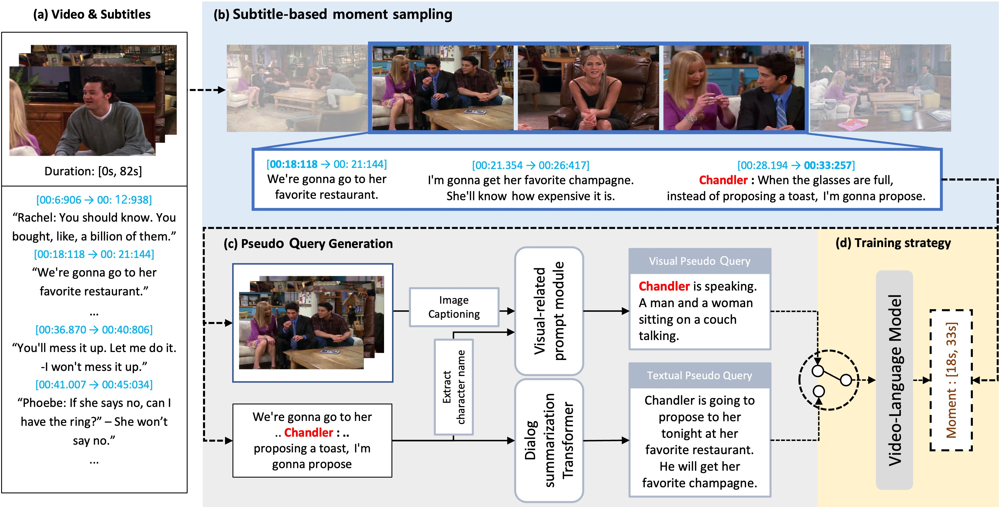

Modal-specific Pseudo Query Generation for Video Corpus Moment Retrieval
=====


PyTorch Implementation of paper:

[Modal-specific Pseudo Query Generation for Video Corpus Moment Retrieval.](https://arxiv.org/abs/2210.12617)

[Minjoon Jung](https://minjoong507.github.io/), Seongho Choi, Joochan Kim, [Jin-Hwa Kim](http://wityworks.com/), [Byoung-Tak Zhang](https://bi.snu.ac.kr/~btzhang/)

## Getting started
This project is implemented based on Pytorch with Anaconda.

### Get the repo
```angular2html
git clone https://github.com/minjoong507/MPGN.git
```
### Prepare feature files

Download the [original feature files](https://drive.google.com/file/d/1j4mVkXjKCgafW3ReNjZ2Rk6CKx0Fk_n5/view). Also, please check [here](pseudo_query_generation) to generate pseudo supervision.

### Environment
Our environments:
- Python 3.9
- PyTorch 1.13.1
- CUDA 12.0

You can also run our code under the same environments in [TVR](https://github.com/jayleicn/TVRetrieval).

## Training the model

We give the code for training the Cross-modal Moment Localization (XML).

If you want to train the model with the pseudo queries, you can use `--training_w_pseudo_supervision` and also use `--training_strategy` to decide the type of pseudo queries (`visual`, `textual`, `aug`). `aug` refers to using both type of the pseudo queries.
```angular2html
bash baselines/crossmodal_moment_localization/scripts/train.sh \
tvr video_sub resnet_i3d \
--exp_id test_run \
--training_w_pseudo_supervision \
-- training_strategy aug
```

## Citations

If our project is useful to your research, please consider citing our papers:
```
@inproceedings{jung2022modal,
  title={Modal-specific Pseudo Query Generation for Video Corpus Moment Retrieval},
  author={Minjoon Jung and Seongho Choi and Joochan Kim and Jin-Hwa Kim and Byoung-Tak Zhang},
  booktitle={EMNLP},
  year={2022}
}
```
## Acknowledgement

Our project follows the codes in [TVR](https://github.com/jayleicn/TVRetrieval).  We thank the authors for sharing their great work.
